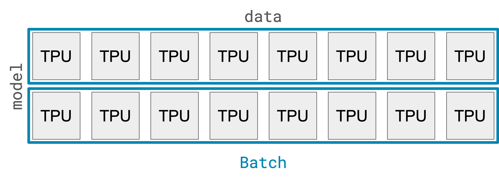
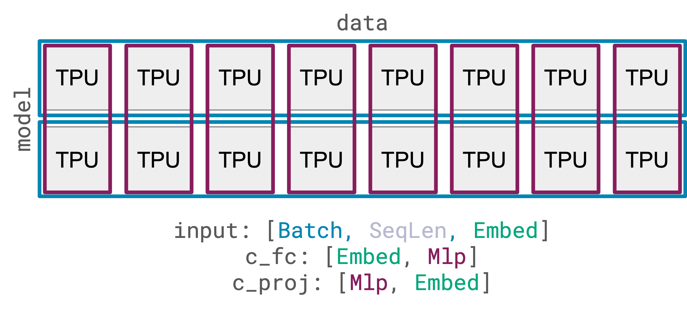

# Levanter

This is the remains of a detailed introduction to the Levanter project.

You should now look at the official tutorials:

* [Introduction to Haliax with Transformers](https://colab.research.google.com/drive/1TiTcQQ4V5mopbgCu1SVl-oqJtXn7rFnC)
* [Distributed Training in Haliax](https://colab.research.google.com/drive/1QX4yH3zRFF3Xiibf1aahETcSQ5nbcUMz) (including FSDP)

What follows are the pieces that haven't been integrated into the tutorials yet.

## Mixed Precision Training with `jmp`

A first easy win is to use mixed precision training. This is a technique where you store the parameters (and optimizer
states) in full precision, but only use half precision (bfloat16) for the activations. This reduces the memory footprint
of the model and optimizer states by a factor of 2: so our 750M parameter model would only need 6GB of memory. This is a
significant win, and it's easy to do with Jax and a library called [`jmp`](https://github.com/deepmind/jmp).
It also dramatically improves speed. A100s advertise a 15x speedup for bfloat16 or float16 over float32.

We could just do everything in bfloat16, but there's been lots of reports that, even when stable, keeping everything in
bfloat16 can lead to worse performance. For instance, the [Gopher paper](https://arxiv.org/pdf/2112.11446.pdf) found a
~.15 nat loss increase at 417M parameters, which is consistent with what we found in our experiments. So, we'll keep the
parameters and optimizer states in float32, and use bfloat16 for the activations.

[`jmp`](https://github.com/deepmind/jmp) is a very small library that manages mixed precision. You just make a `Policy`
that lets you specify the underlying dtype for three "semantic" dtypes: parameter, compute, and output. The policy
has methods for convert an array or pytree of arrays to the appropriate dtype, and for converting back to each
of these semantic dtypes.

```python
import jmp
policy = jmp.get_policy("compute=bfloat16,parameter=f32,output=f32")

policy.cast_to_compute(my_model)  # Convert x to bfloat16
```

To plug this into our trainer, we need to make just two changes. First, when we create our model, we cast it to the
param dtype. Next, when we get ready to compute the loss, we cast the model to the compute dtype.

Here's what that looks like in our training code:

```python
training_data = load_training_data()
model_config = Gpt2Config()

# NEW: initialize a policy. Ordinarily we'd get this from config
# ordinarily we'd get this from config
policy = jmp.get_policy("compute=bfloat16,parameter=f32,output=f32")

key = jax.random.PRNGKey(0)

model_key, training_key = jax.random.split(key, 2)

Vocab = Axis("vocab", len(tokenizer))
Batch = Axis("batch", 8)
SeqLen = Axis("seq_len", 128)

compute_mapping = {"batch": "data"}
param_mapping = {"embed": "data"}

with Mesh(jax.devices(), ("data",)):
    # NEW: cast the model to the param dtype
    @hax.named_jit(axis_resources=param_mapping)
    def init_model():
        model = Gpt2LMHeadModel(model_config, key=model_key)
        return policy.cast_to_param(model)


    model = init_model()

    optimizer = optax.adamw(learning_rate=1e-4)
    opt_state = hax.named_jit(optimizer.init, axis_resources=param_mapping)(model)


    # loss of a single example
    def compute_loss(model, input_ids, key, inference):
        with hax.axis_mapping(compute_mapping):
            # NEW: cast the model to the compute dtype
            model = policy.cast_to_compute(model)
            pred_y = model(input_ids, key=key, inference=inference)
            # NEW: cast the output to the output dtype
            pred_y = policy.cast_to_output(pred_y)
            return next_token_loss(SeqLen, Vocab, pred_y, input_ids)


    # loss of a batch
    def train_batch_loss(model, input_ids, key):
        per_ex_loss = hax.vmap(compute_loss, "batch")(model, input_ids, key, inference=False)
        return hax.mean(per_ex_loss, "batch").scalar()


    # return value and gradient of loss
    grad_loss = eqx.filter_value_and_grad(train_batch_loss)


    def train_step(model, opt_state, input_ids, keys):
        loss, grads = grad_loss(model, input_ids, keys)

        # distribute gradients across the mesh and apply them
        updates, opt_state = optimizer.update(grads, opt_state, params=model)
        model = eqx.apply_updates(model, updates)

        return loss, model, opt_state


    train_step_pjit = hax.named_jit(train_step, axis_resources=param_mapping)

    for batch_input_ids in training_data:
        my_key, training_key = jrandom.split(training_key, 2)
        batch_key = jrandom.split(my_key, Batch.size)

        jax_step_loss, model, opt_state = train_step_pjit(model, opt_state, batch_input_ids, batch_key)
        step_loss = jax_step_loss.item()
        print(f"step loss: {step_loss:.4f}")
```

## Tensor Parallelism with Activation Sharding

We now have everything we need to train models of 10-20B parameters (except for gradient checkpointing, which we discuss at the very end).
So what follows is not all that necessary for training, but it is helpful for inference and good for pedagogy.

Activation partitioning is a technique that allows you to split up the activations of a model across multiple devices.
Typically, this is accompanied by model partitioning, which splits up the parameters of the model across multiple devices.
This is distinct from FSDP, which also splits up the model parameters and associated states. The difference is that
activation partitioning shards intermediate computations for a single example (like attention or the MLP in the transformer)
across devices, and combines the results through communication, while (by itself) FSDP always performs the entire
computation for a given example on a single device.
As a note, there are at least two things people call "model parallelism." The first is activation sharding, which is what
we're going to cover here. The second is pipeline parallelism, which is a technique for splitting a computation into
multiple stages, and then running each stage on a different device. We haven't implemented pipeline parallelism in
Levanter yet, but it's on our roadmap.

### Device Meshes for Tensor Parallelism

So far, we've only had device meshes with a single axis. Now, let's add a second axis, and call it `model`:


As before we'll use the `data` axis for data parallelism (as well as storing parameters with FSDP), and the new `model`
axis we'll use for model parallelism. In this section, we'll ignore FSDP for now and just focus on activation sharding.

Now, if we map our `Batch` axis to the `data` axis, then our data is replicated two times, so that each row of the
`model` axis gets a copy of the data:



Now let's talk about partitioning our model. Jax partitions things in terms of axes, so we need to choose which
axes of our model we want to partition. Let's focus on just the MLP part of our model for now, and ignore the
attention heads. Our MLP has two Linear modules `c_fc` and `c_proj`. `c_fc` has shape `[Embed, Mlp]`, and
`c_proj` has shape `[Mlp, Embed]`. (There are bias terms but we'll ignore them for now.)

We're going to partition the `Mlp` axis of our model, and leave the `Embed` axis unpartitioned. This means that
each column of our device mesh will get a complete copy of the parameters. The top row will get the first `Mlp/2`
columns of `c_fc`, and the bottom row will get the second `Mlp/2` columns of `c_fc`. (Similarly for `c_proj`.)



What's more, when we do computations with this parameter, Jax will partition the computation and the result for us
in the "right way." For example, when we multiply our `input: [Batch, SeqLen, Embed]` by the matrix parameter
of `c_fc: [Embed, Mlp]` to get a result `intermediate: [Batch, SeqLen, Mlp]`, Jax will automatically partition
the computation and the result so that the `Batch` axis is partitioned along the `data` axis, and the `Mlp` axis
is partitioned along the `model` axis. Thus, the `intermediate` result will be partitioned along both axes, so
that no device shares any data with another device. That looks like this:


When we do the next computation, where we matrix-multiply `intermediate: [Batch, SeqLen, Mlp]` by `c_proj: [Mlp, Embed]`,
Jax will "do the right thing" so that the `Batch` axis is partitioned along the `data` axis, and the `Embed` axis
is replicated, so that the final result `output: [Batch, SeqLen, Embed]` is also partitioned in the same way as the original
`input: [Batch, SeqLen, Embed]`.

### Tensor Parallelism with Haliax

Now that we've seen how to do activation sharding, let's talk about how to make it easier to use. Jax's

`pjit` is great, but it can be a bit of a pain to use when you have a lot of inputs and outputs. For example, if you
have a complex nested model hierarchy (e.g. our GPT-2) it can be difficult to specify the partitioning for each
parameter.

This is where named axes come in. With Haliax, you can specify a "physical" (i.e. mesh) axis name for each
named axis in your model. Then, you just call `named_pjit` with the name of the function you want to partition, and
the `dict` containing those mappings. That's it! Here's that same example from above, but using named axes:

```python
import haliax as hax
from haliax.partitioning import named_jit
import jax
import numpy as onp

Batch = hax.Axis("batch", 128)
Embed = hax.Axis("embed", 64)
Intermediate = hax.Axis("intermediate", 512)

inputs = hax.ones((Batch, Embed))
weights = hax.ones((Embed, Intermediate))


def matmul(weights, inputs):
    return weights.dot(Embed, inputs)


# assume we have 8 devices, e.g. a v3-8 TPU node
devices = onp.array(jax.devices()).reshape((4, 2))
mesh = Mesh(devices, ("model", "data"))

pjit_matmul = named_jit(matmul, axis_resources={"intermediate": "model", "batch": "data"})

with mesh:
    print(pjit_matmul(x, y))
```

And you're done! If you want to have different partitioning for inputs and outputs, you can specify those separately:

```python
pjit_matmul = named_pjit(matmul,
                         in_axis_resources={"intermediate": "model", "batch": "data"},
                         out_axis_resources={"batch": "data"})
```

### Model-Partitioned GPT-2 Training

Now that we've covered the basics of `pjit` and our named variant, let's see how we can use it to train a model-parallel
GPT-2 model. The basic idea is to create the two-dimensional mesh we saw above, and then use `named_pjit` to partition
the right axes of the model across the `model` axis.

```python
training_data = load_training_data()
model_config = Gpt2Config()

policy = jmp.get_policy("compute=bfloat16,parameter=f32,output=f32")

key = jax.random.PRNGKey(0)

model_key, training_key = jax.random.split(key, 2)

Vocab = Axis("vocab", len(tokenizer))
Batch = Axis("batch", 8)
SeqLen = Axis("seq_len", 128)

# NEW: specify axes to do model parallelism on
compute_mapping = {"batch": "data", "mlp": "model", "head": "model"}
param_mapping = {"embed": "data", "mlp": "model", "head": "model"}

# NEW: specify a 2D mesh with model_axis_size
model_axis_size = 2
mesh = Mesh(onp.array(jax.devices()).reshape((-1, model_axis_size)), ("data", "model"))

with mesh:
    @hax.named_jit(axis_resources=param_mapping)
    def init_model():
        model = Gpt2LMHeadModel(model_config, key=model_key)
        return policy.cast_to_param(model)


    model = init_model()

    optimizer = optax.adamw(learning_rate=1e-4)
    opt_state = hax.named_jit(optimizer.init, axis_resources=param_mapping)(model)


    # loss of a single example
    def compute_loss(model, input_ids, key, inference):
        with hax.axis_mapping(compute_mapping):
            model = policy.cast_to_compute(model)
            pred_y = model(input_ids, key=key, inference=inference)
            pred_y = policy.cast_to_output(pred_y)
            return next_token_loss(SeqLen, Vocab, pred_y, input_ids)


    # loss of a batch
    def train_batch_loss(model, input_ids, key):
        per_ex_loss = hax.vmap(compute_loss, "batch")(model, input_ids, key, inference=False)
        return hax.mean(per_ex_loss, "batch").scalar()


    # return value and gradient of loss
    grad_loss = eqx.filter_value_and_grad(train_batch_loss)


    def train_step(model, opt_state, input_ids, keys):
        loss, grads = grad_loss(model, input_ids, keys)

        # distribute gradients across the mesh and apply them
        updates, opt_state = optimizer.update(grads, opt_state, params=model)
        model = eqx.apply_updates(model, updates)

        return loss, model, opt_state


    train_step_pjit = hax.named_jit(train_step, axis_resources=param_mapping)

    for batch_input_ids in training_data:
        my_key, training_key = jrandom.split(training_key, 2)
        batch_key = jrandom.split(my_key, Batch.size)

        jax_step_loss, model, opt_state = train_step_pjit(model, opt_state, batch_input_ids, batch_key)
        step_loss = jax_step_loss.item()
        print(f"step loss: {step_loss:.4f}")
```

And that's tensor parallelism!

## Other Techniques
### Gradient Checkpointing

Gradient checkpointing is a technique for reducing memory consumption when training deep models. The basic idea is to
trade compute for memory: instead of storing all of the activations of a layer, we recompute them on the backward pass.

In Jax, you can use `jax.checkpoint` to do this. If you're using Haliax and `Stacked`, then you can instead
just pass `gradient_checkpointing=True` to `Stacked` and it will automatically checkpoint. Typically this is where
you want checkpointing to happen, since it's the most memory-intensive part of the model.

### Argument Donation

Another technique for reducing memory consumption is argument donation. The basic idea is that if you have a function
that takes a large argument that you won't need after the function returns, you can donate that argument to the function
and then delete it after the function returns. You usually use this for thing you're planning on updating and don't need
to keep around, like optimizer state or the model parameters.

In Jax, you can use `jax.jit` (or `pjit`) to do this. If you're using Haliax's `named_pjit`, you can specify which
arguments to donate with the `donate` argument, which takes a PyTree-prefix of the arguments to donate. For instance,
this will donate the model and opt_state to the train step:

```python
def train_step(model, opt_state, input_ids, keys):
    loss, grads = grad_loss(model, input_ids, keys)

    # distribute gradients across the mesh and apply them
    updates, opt_state = optimizer.update(grads, opt_state, params=model)
    model = eqx.apply_updates(model, updates)

    return loss, model, opt_state


train_step_pjit = hax.named_jit(train_step, axis_resources=param_mapping, donate=(True, True, False, False))
```
